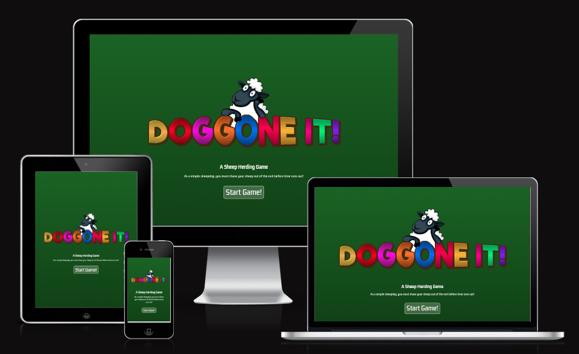
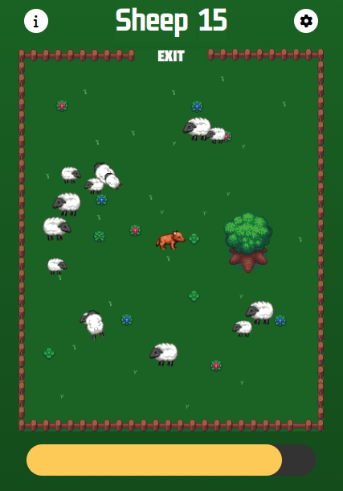
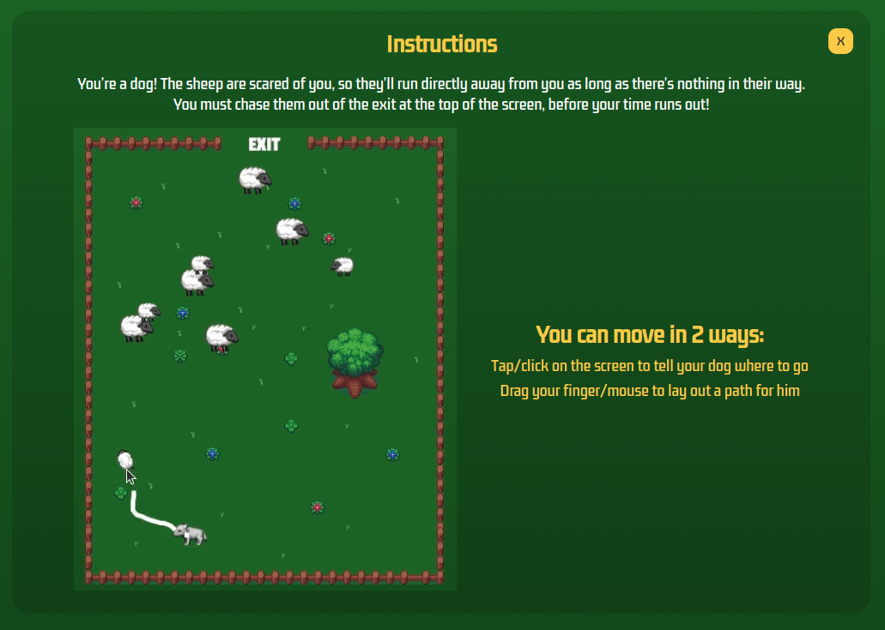
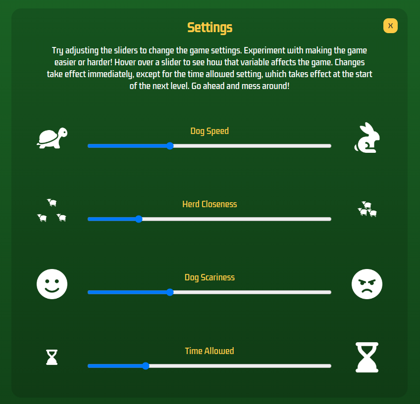
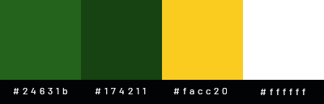
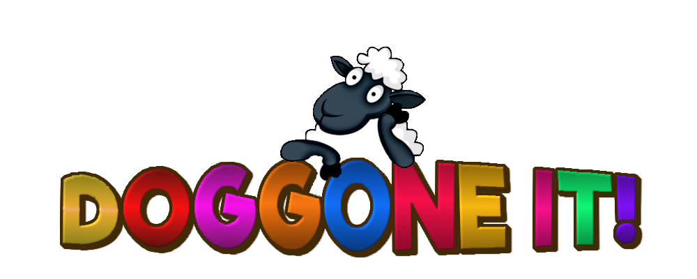
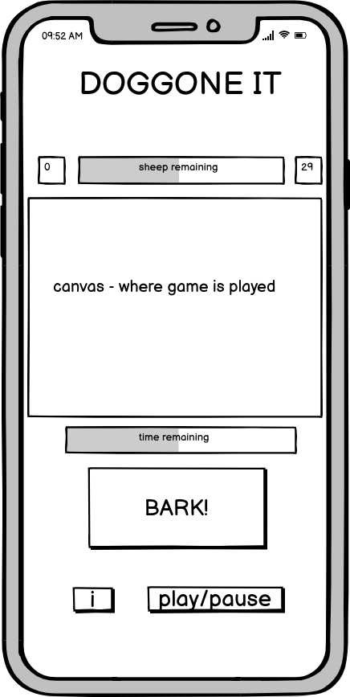
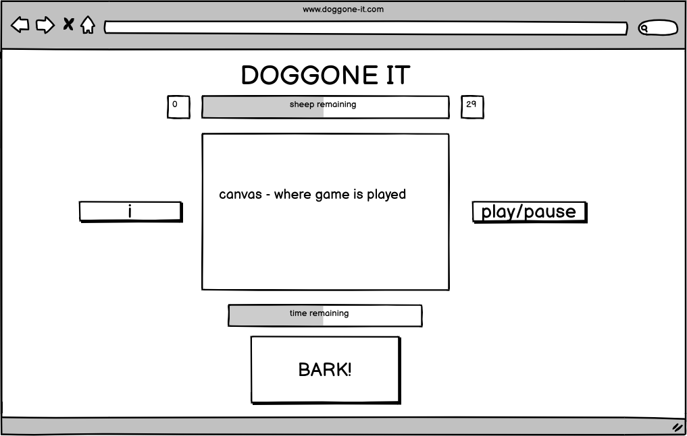
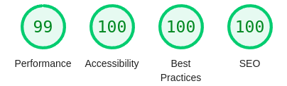
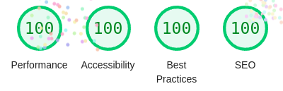

# **Doggone It Website**

### A website that lets visitors play a simple sheep herding game.

[View the live project here](https://johnrearden.github.io/doggone-it/)

---

# Project Rationale

# Features

- ### Landing page
    As can be seen in the screenshots above, this is the first view the visitor has of the site, and consists of a colourful
    logo with a cartoon sheep resting on the title of the site, a brief description
    of the game, and a start button.
- ### Main Game Page
    This page contains the game display and controls. The visitor controls their sheepdog by tapping/clicking where they want him to go, or by dragging their mouse/finger to record a path for him. The sheep run away from the dog, and the aim of the game is to force the sheep out the exit gate at the top of the screen.
    At the top of the screen there is a display which tells the player how many sheep are left in the game area, flanked by 2 buttons, which open the instructions and settings modals respectively. At the bottom of the screen there is a progress slider which runs backwards to indicate the time left for the level.

    

- ### Instructions display
    This is a modal display, hidden on page load and made visible when the instructions button is clicked on the main game page. At the top there is a heading, with the close button for the modal next to it in the conventional top-right position. Below this is a paragraph outlining the object of the game in general terms. Below this again is a video of one of the levels being played, and next to it a description of the controls for the game. The video is muted by default, and does not autoplay.

    
- ### Settings display
    This is another modal display, hidden on page load as with the instructions display. Below the 'Settings' title (and the conventional close button), there are four sliders, bookended on each side by an explanatory icon and with a text label above them. They allow the player to modify the speed the dog moves at, how close the herd clings together, how frightening they find the dog, and the time available for the level. The slider values are ratios, which are multiplied by the default values for these game characteristics each time the slider position is changed.

    

- ### Possible future features
    - Dynamic hazards can be added to the game to frighten the sheep, such as bees maybe?
    - Sound effects and music could be added to enhance the player experience

---

# User Experience (UX)

- ### User Stories

    - #### First Time Visitor Goals
        - As a first-time visitor, I want to be able to quickly engage in the game, 
        with a minimum of setup.
        - As a first-time visitor, I want to find the game controls straightforward
        and easy to use.

    - #### Returning Visitor Goals
        - As a returning visitor, I want to be challenged as I progress in the game
        - As a returning visitor, I would like to watch a replay of my games to
        learn from my mistakes.

    - #### Frequent Visitor Goals
        - As a frequent visitor, I would like to be able to experiment with some 
        of the game mechanics and customize them without breaking the gameplay.
- ### Design

    The site was designed from the beginning with a mobile first approach. This is especially appropriate for a game project, as it is much more likely that a game would be played on a mobile device than on a desktop.

    - Colour Scheme
        - The site uses the following colour scheme :
        
        - Paragraph text within the site is white, and all buttons use the gold color. The background on the main landing and game pages, and on the modal displays is a vertical gradient between the 2 shades of dark green. These colours were chosen to ensure a bright and bold impression on the visitor, with high contrast to help with text readability. This is complemented by the multi-colour logo on the landing page, which suggests a fun, exciting user experience rather than anything functional or serious.
        

    - Typography
        - The main font used on the site is Kdam Thmor Pro, which is sourced from Google Fonts. I chose this font to mimic the typical fonts used in retro-style computer games, which usually have a blocky and square appearance. Having experimented with more pixelated examples of this genre, I decided to go with a smoother font, and sacrifice some of the retro authenticity for readability.
        - The font used for the site logo on the landing page is Riffic Free Bold, which is a free subset of a larger font family by InkyType. It was sourced from dafont.com. I used this font as I wanted a cartoon feel for the logo. It was downloaded as a .ttf file and imported it into GIMP, where it was used in the creation of the site logo. As it is not used to render any of the HTML content and only appears in the logo .png file, it is not imported into the project proper.

    - Imagery
        - The main characters in the game, the dog and the sheep, are basic 3 frame animations, which are oriented in four different directons (North, South, East and West), making 12 sprites in all for each character. The backgrounds for each level were created in GIMP and imported into the project.

- ### Wireframes

    - 

    - 

    
# Technologies Used

## Languages used

- HTML
- CSS
- JavaScript
    - Features from ECMAScript 2015 (ES6) and ECMAScript 2017 (ES8) were used in the project. ES6 modules were used as I wanted to separate out the objects used in the game into separate modules to facilitate testing and possible future reuse. ES8 async/await functionality was used to wrap image loading in Promises. In order to ensure backwards compatability with browsers which do not fully support more recent versions of Javascript, babel was used to transpile the module code to ES5, which has broader support. This would have been necessary even without this consideration as Jest, the testing framework used in the project, does not play happily with ES6 as outlined in the [TESTING.md](TESTING.md) section.

## Libraries and Programs Used
1. [Google Fonts](https://fonts.google.com/) 
    - Google Fonts were used to import the 'Quicksand' font which is used throughout the website.
2. [Font Awesome](https://fontawesome.com/icons)
    - Font Awesome was used throughout to add icons to enhance UX.
3. [GIMP](https://www.gimp.org/)
    - GNU Image Manipulation Program was used as an open source alternative to Photoshop to scale and alter all of the images on the site.
4. [SimpleScreenRecorder](https://www.maartenbaert.be/simplescreenrecorder/)
    - This linux screen recorder was used to record the gameplay for the instructions 
    screen video.
5. [Balsamiq](https://balsamiq.cloud/)
    - All wireframes were designed using Balsamiq.
6. [Git](https://git-scm.com/)
    - Version control was implemented using Git through the Github terminal.
7. [Github](https://github.com/)
    - Github was used to store the projects after being pushed from Git and its cloud service [Github Pages](https://pages.github.com/) was used to serve the project on the web.
8. [Visual Studio Code](https://code.visualstudio.com/)
    - VS Code was used locally as the main IDE environment, primarily because it was easier to set up a development environment locally than in GitPod (I wasn't sure how to persist the Jest installation across different GitPod sessions)
9. [NPM and Node.js](https://www.npmjs.com/)
    - NPM and Node.js were used to install jest, babel and webpack (see next 3 items)
10. [Jest](https://jestjs.io/)
    - The Jest framework was used to run unit tests on some of the central modules used in the project
10. [babel](https://babeljs.io/)
    - Babel was used to transpile the source code (containing ES6 and ES8 elements) to more broadly supported ES5 code
11. [webpack](https://webpack.js.org/)
    - Webpack was used to build the project using the babel transpiled code.

# Testing

## Testing User Stories from UX section

- #### First Time Visitor Goals
    - A first time visitor is able to play the game with a minimum of effort. One click allows them to navigate from the landing page to the game page, and then the game itself can be started at will with one more click on the READY! button.
    - The controls are simple and intuitive - the player can either tap/click on the game area to set a destination for the dog, or drag on the game area to lay out a path for the dog. Both of these control mechanisms harness common user actions across all types of applications, and so do not require the player to learn anything new to play the game. The instructions page provides both a video of normal gameplay and a text description of the two control methods, and can be navigated to with a press of the instructions button, which uses a conventional 'i' icon to denote information available.

- #### Returning Visitor Goals
    - A returning visitor is challenged by increasing difficulty (in the form of more sheep and obstacles and less time) as they progress through the three levels in the game.
    - A returning visitor is also presented with the option to watch an action replay at the end of each level, which can be run backwards, forwards and at 2 different speeds to enable them to observe their own actions and learn from their mistakes.

- #### Frequent Visitor Goals
    - A frequent visitor is also able to click/tap the settings button (decorated with a standard gear icon) and alter 4 different game settings. This enables them to 'mod' their own version of the game, experimenting with changes that can make it easier or more difficult.
---

## Validator Testing

- HTML Validation
    - No errors or warnings on index.html or game.html on Nu Html Checker

- CSS Validation
    - No errors found using the W3C CSS Validation Service

    - 

- JShint Validation
    - No errors found in project.
    - 4 warnings regarding outer scoped variables referenced in functions defined within loops in index.js.

    
- Lighthouse report
    - For index.html   : 
    - For game.html   :  

---

## Automated Testing

- Unit tests were written for the project using Jest. A description of the process I undertook to set up my testing environment on my local machine can be found [here](TESTING.md). The tests can be run on GitPod using the following commands :
    - `$ npm install --save-dev jest`
    - `$ npm test`

## Manual Testing
Feature | Expected | Action | Result
--------|----------|--------|-------
Start Game button | Links to game.html | Clicked on button | game.html opened successfully
Ready button | Starts game at level 1 | Clicked on button | Game begins on correct level
Instructions button (text) | Opens instructions modal | Clicked on button | Modal opens successfully
Instuctions button (icon) | Opens instructions modal | Clicked on button | Modal opens successfully
Settings button (icon) | Opens settings modal | Clicked on button | Modal opens successfully
Instructions close button | Returns player to previous screen | Clicked on button | Successful return to previous screens both at start of game and during gameplay (no time lost)
Settings close button | Returns player to previous screen | Clicked on button | Successful return to previous screens both at start of game and during gameplay (no time lost)
Out of time display | Should show Out of Time message, Action Replay button, Try Again button and Instructions (text) button| Ended level with remaining sheep and time run out | Correct message and all 3 correct buttons appear
Action Replay button| Should launch replay of level just finished | Clicked on button | Replay launched successfully
Try Again button | Should allow player to replay failed level | Clicked on button | Same uncompleted level begins again
Level Complete Display | Should show Level Complete message and 3 buttons : Action Replay, Next Level and Instructions | Finished level successfully | Correct message and 3 buttons displayed
Game complete display | Should show game complete message ('You beat the game!'), action-replay button and instructions button | Finished game successfully | Message and correct 2 buttons displayed
Next Level button | Should begin the next level | Clicked on button | Next level begins successfully
Dog destination set by click | The dog should move to the last clicked point on the game canvas | Clicked on multiple points | The dog proceeds to each one correctly
Dog path set by dragging | The dog should follow the path of the pointer after it is dragged across the canvas | Dragged pointer in multiple paths | Dog follows paths consistently
Instructions video | Video should be muted by default, and should not autoplay | Opened instructions modal | No sound on video and does not autoplay
Settings dog speed slider | Slider should increase speed when slid to right, decrease when slid to left | Moved slider to right | Dog speed increases
||| Moved slider to left | Dog speed decreases
Settings sheep closeness slider | Should cause the sheep to huddle closer together when slid right, further apart when slid left | Moved slider to right | Sheep huddle closer
||| Moved slider to left | Sheep spread further apart
Settings dog scariness slider | Sliding right should increase the range at which the sheep react to the dog | Moved slider to right | Sheep react when dog is further away
|| Sliding left should decrease the range at which the sheep react to the dog | Moved slider to left | Sheep don't react until the dog gets closer

---

## Further Testing

### Device testing:
- The project was tested on the following physical devices : 
    - iPhone 12
    - Samsung S8
    - Lenovo laptop (1366 x 768) : The vertical viewport width was very limited as the browser tab and address bars being visible resulted in an effective viewport aspect ratio of only 587 of the available 768 pixels. To mitigate this wide aspect ratio, I added a media query for short screens which compresses the vertical height of the main game view
    - Desktop with monitor (1920 x 1080) 

# Bugs

## Outstanding bugs
- There are no outstanding bugs in the project.

## Bugs found and solutions developed
- There was a problem with the sprite choice for the sheep. If a sheep's movement toward the herd center was balanced against it's movement away from the dog, it would thrash over and back across the balance point, switching the sprite drawn rapidly.
    - Solution found : In this case, the resultant velocity would be very small, so I set any velocity smaller than a low threshold to zero, and eliminated the thrashing.

# Deployment

### GitHub Pages
The website is deployed on Github Pages. The deployment procedure is as follows :
- Navigate to the Github repository [www.github.com/johnrearden/doggone-it](https://www.github.com/johnrearden/less-is-more)
- In the Github repository, navigate to the Settings tag and select Pages
- From the source section drop-down menu, select the Master branch.
- The page should be refreshed with a message to indicate successful deployment.

### Forking the Github Repository
You can make a copy of the original repository to view and/or make changes without affecting the original repository by using the following steps:
- Log in to GitHub and locate the repository [www.github.com/johnrearden/doggone-it](https://www.github.com/johnrearden/less-is-more)
- At the top of the Repository (not top of page) just above the "Settings" button on the menu, locate the "Fork" button.
- You should now have a copy of the original repository in your GitHub account

### Making a Local Clone
- Log in to Github and locate the repository [www.github.com/johnrearden/doggone-it](https://www.github.com/johnrearden/less-is-more)
- Under the repository name, click "Clone or download".
- To clone the repository using HTTPS, under "Clone with HTTPS", copy the link.
- Open Git Bash
- Change the current working directory to the location where you want the cloned directory to be made.
- Type `git clone`, and then paste the URL you copied in Step 3.

    `$ git clone https://github.com/johnrearden/doggone-it`

- Press Enter. Your clone will be created.

### Building the project locally
- The project is built using webpack, with a transpilation stage run by babel to convert the ES6 modules and promises in the source code back to ES5 compliant syntax. To build the project in your local environment, complete the following steps.
- With npm and node.js already installed : 
    - `npm install webpack webpack-cli`
    - `npm run build`

# Credits
## Images:

How to make a cartoon text - OCELOTHE
https://www.youtube.com/watch?v=_iH-34i6kYE

Sheep image for logo from dagadu, purchased from colorbox.

Sheep sprites by whtdragom
https://rpgtileset.com/sprite/sheep-sprite-for-rpg-maker-mv/

Dog sprites by Ramona Emor, sourced from Pinterest
https://www.pinterest.com/pin/374572894012956347/

Tortoise icon:
https://www.flaticon.com/free-icons/tortoise

Hare icon: 
https://www.flaticon.com/free-icons/rabbit

Sheep icon:
https://www.flaticon.com/free-icons/lamb

All other icons from [Font Awesome](https://fontawesome.com/icons)

## Fonts: 
Kdam Thmor Pro, by Tep Sovichet & Hak Longdey, from Google Fonts
https://fonts.google.com/?query=Kdam

Riffic Free Bold, by InkyType
https://www.dafont.com/riffic.font

## Code Credits:
CSS aspect-ratio property:
https://www.smashingmagazine.com/2020/03/setting-height-width-images-important-again/ 

CSS flex-box:
https://css-tricks.com/snippets/css/a-guide-to-flexbox/

How to code a JavaScript game loop
https://spicyyoghurt.com/tutorials/html5-javascript-game-development/create-a-proper-game-loop-with-requestanimationframe

Drawing a sprite with an arbitrary rotation and position
https://stackoverflow.com/questions/32468969/rotating-a-sprite-in-a-canvas

Use async/await to halt program until all images are loaded
https://stackoverflow.com/questions/37854355/wait-for-image-loading-to-complete-in-javascript

Value of this in callback functions from global scope
https://www.w3docs.com/snippets/javascript/how-to-access-the-correct-this-inside-a-callback.html

Preventing touch events from scrolling the screen on mobile
https://stackoverflow.com/a/26591826

How to style a progress bar
https://verpex.com/blog/website-tips/how-to-style-a-progress-bar-using-css

---

## Acknowledgements
- I would like to thank my tutor, Okwudiri Okoro, for his valuable assistance during the course of this project. 

- I would also like to thank our course facilitator, Kenan Wright, for his help during the weekly stand-up meetings. 

- Special thanks to my family for allowing me to carve 15-20 hours a week out of our busy schedule to work on this course!